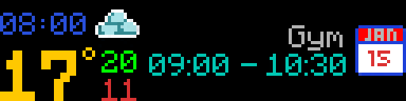
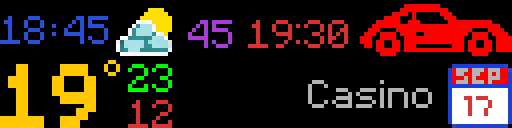
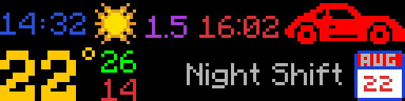
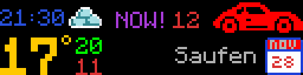

# Smart Pixel Dashboard

A smart dashboard display for 128x32 RGB LED matrix panels. It runs on anything that has Python and Bluetooth, personally I use a Raspberry Pi Zero 2 W. The display itself just needs to support BLE and the pypixelcolor protocol - I use an iPixel panel.

Four panels cycle on the display based on time, whether music is playing, and what's coming up on the calendar. You can also switch between them manually through the web UI or the REST API.


What it does:
- Shows the current time as a full-screen 24h clock (always on as fallback)
- Fetches the YouVersion verse of the day and shows it during configured time windows
- Picks up your currently scrobbling track from Last.fm or Libre.fm and renders album art, BPM-synced visualizer, and a progress bar
- Pulls in live weather and calendar events with departure countdowns

→ [Jump to Setup](#setup)

## Hardware

- Display: 128x32 RGB LED matrix with BLE + pypixelcolor support (e.g. iPixel)
- Controller: any device with Python 3 and Bluetooth (Raspberry Pi, laptop, etc.)

BLE communication uses [pypixelcolor](https://pypi.org/project/pypixelcolor/).

## Panels

Each panel has a priority in `assets/config.toml`. Higher number wins. Clock is always on as the fallback at priority 1.

The scheduler handles switching automatically. Now Playing triggers when it detects a track scrobbling; Dashboard triggers when a calendar event is active; Verse of Day fires on a probability roll during its configured time windows. Manually triggering a panel from the web UI or API overrides the auto-scheduler until you hit "reset to auto". Outside `active_hours`, the display goes dark.

| Panel | What it shows | Keys needed | Default priority |
|---|---|---|---|
| [Clock](panels/clock/clock.md) | 24h digital clock with blinking colon | None | 1 |
| [Verse of Day](panels/verse_of_day/verse_of_day.md) | Daily Bible verse from YouVersion | `YOUVERSION` | 2 |
| [Now Playing](panels/now_playing/now_playing.md) | Last.fm/Libre.fm track with cover art, BPM visualizer, progress bar | `LASTFM_*` or `LIBREFM_*`, `GETSONGBPM_API_KEY` | 3 |
| [Dashboard](panels/dashboard/dashboard.md) | Live weather and calendar events with travel countdowns | None | 4 |

## Previews

### Clock

24h format. The colon blinks every second.


### Verse of Day

| Short | Medium | Long book name |
|---|---|---|
|  |  |  |

### Dashboard

**Weather only (no calendar events), metric:**

| Clear | Rain | Snow | Storm | Fog |
|---|---|---|---|---|
|  |  |  |  |  |

| Overcast | Partly cloudy |
|---|---|
|  |  |

Temperature color variations (metric):

| +temp, low below 0 | -temp, high above 0 | -temp, all negative |
|---|---|---|
|  |  |  |

Imperial (°F):

| Clear | Snow (below freezing, shifts to blue) |
|---|---|
|  |  |

**With calendar events:**

| Event only (no travel time) | 45 min to leave | Far out (90+ min) |
|---|---|---|
|  |  |  |

LEAVE NOW - the countdown alternates between purple and orange every second:



### Now Playing

| go away - Tate McRae | trying on shoes - Tate McRae | All The Love - Kanye West |
|---|---|---|
|  |  |  |

## Setup

### 1. Configure your device

Add your panel's MAC address to `assets/config.toml`:

```toml
[device]
mac_address = "XX:XX:XX:XX:XX:XX"
```

To find the address, pair the device via Bluetooth and run `bluetoothctl devices`.

### 2. Add API keys

Create a `.env` file in the project root:

```env
# Required for Verse of Day
YOUVERSION=your_youversion_app_key

# Required for Now Playing (pick one scrobbler)
LASTFM_API_KEY=your_lastfm_key
LASTFM_SECRET=your_lastfm_secret
LASTFM_USERNAME=your_lastfm_username

# Or use Libre.fm instead (no API key needed, just credentials)
LIBREFM_USERNAME=your_librefm_username
LIBREFM_PASSWORD=your_librefm_password

GETSONGBPM_API_KEY=your_getsongbpm_key
```

Each panel's docs have step-by-step instructions on where to get these. Dashboard weather works without any API key.

### 3. Start

Run `startup.py`. The web UI will be at `http://<device-ip>:5000`.

## Project structure

```
assets/
  config.toml        - all settings (single source of truth)
  system/            - config, scheduler, REST API
  web/               - web UI (HTML, CSS, JS)
  fonts/             - shared fonts
  icons/             - weather icons, logos
panels/
  clock/             - 24h digital clock
  verse_of_day/      - daily Bible verse
  now_playing/       - Last.fm/Libre.fm music display
  dashboard/         - weather + calendar
.github/
  scripts/           - render_assets.py (generates preview images)
  assets/            - preview images for this README
startup.py           - main entry point
```

## Configuration

Everything lives in `assets/config.toml`. The web UI and API write changes back to disk immediately. Key settings:

```toml
[device]
active_hours    = [6, 22]      # display off outside these hours
flip_vertical   = true         # for panels mounted upside-down
flip_horizontal = true

[clock]
brightness = 80
color      = [0, 255, 0]

[verse_of_day]
enabled     = true
probability = 0.30             # chance to auto-trigger per scheduler tick

[nowplaying]
brightness = 80
scrobbler  = "lastfm"          # "lastfm" or "librefm"

[dashboard]
[dashboard.weather]
lat      = 48.2082
lon      = 16.3738
units    = "metric"            # "metric" or "imperial"
```

Supported weather providers: Open-Meteo, wttr.in, NWS (US only). None require an API key. Set with `provider = "openmeteo"` (default), `"wttr"`, or `"nws"` under `[dashboard.weather]`.

## Web UI and API

The web UI at port 5000 lets you switch panels, adjust brightness, and change settings. The REST API:

```
GET    /status                 - active mode, connected state, clearing status
POST   /mode/trigger/{name}   - trigger a mode: clock | verse_of_day | nowplaying | dashboard
DELETE /mode/{name}           - untrigger a mode (returns to scheduler)
POST   /mode/reset            - clear all manual triggers, hand back to auto-scheduler
POST   /calendar              - push a calendar event to the dashboard
DELETE /calendar              - clear all calendar events
GET    /dashboard/status      - current dashboard data
GET    /config                - full config dump
POST   /config/{section}/{key} - update a config value
```

## Running on boot

```bash
sudo cp assets/system/smart-pixel-dashboard.service /etc/systemd/system/
sudo systemctl enable --now smart-pixel-dashboard
```

## License

[GPL-3.0](LICENSE) - any software that uses or distributes this code must also be released under the same license.
